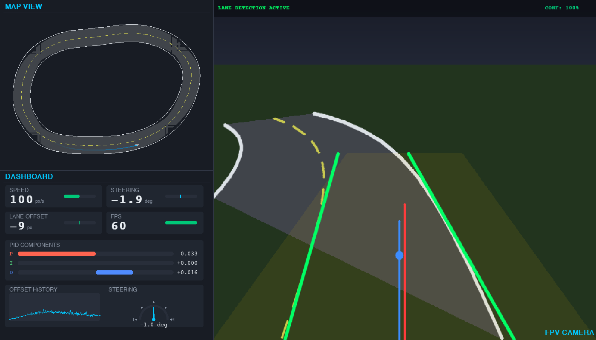
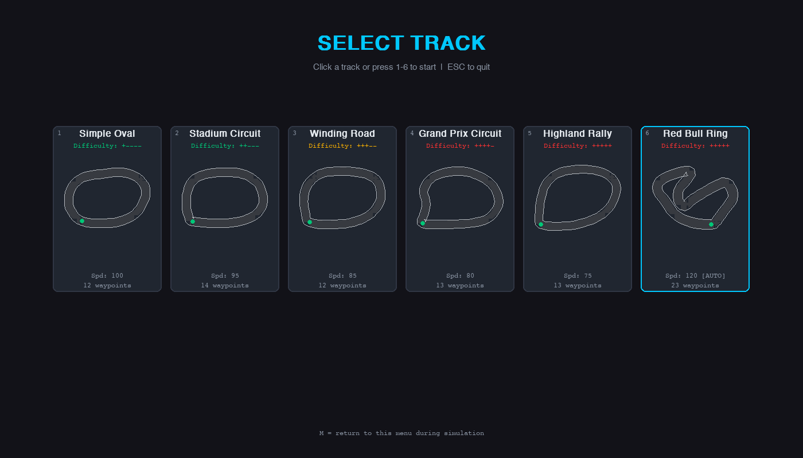
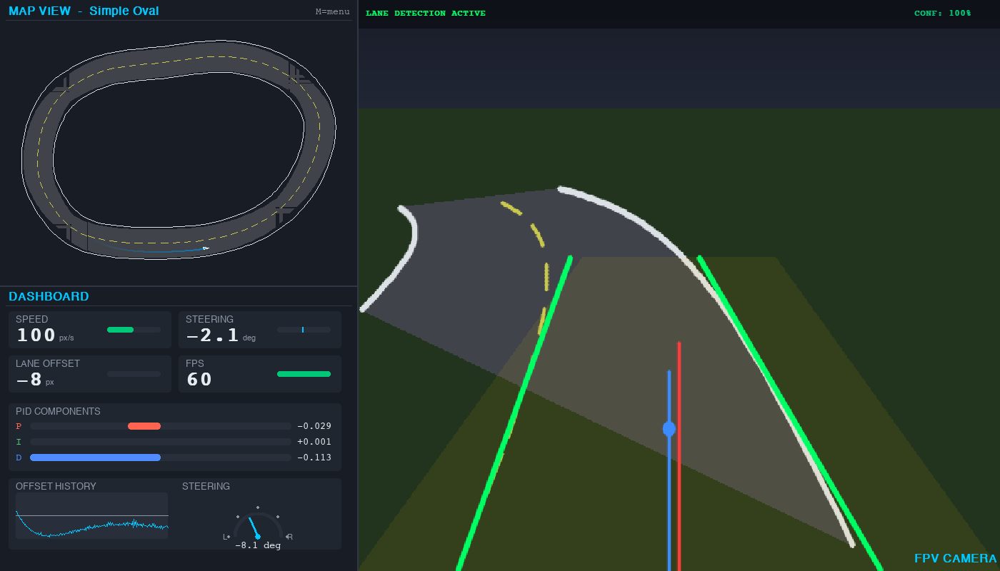
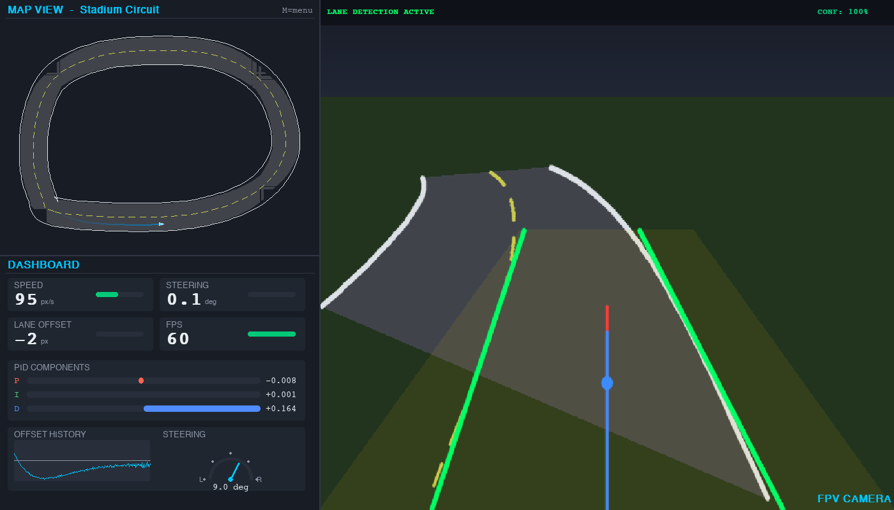
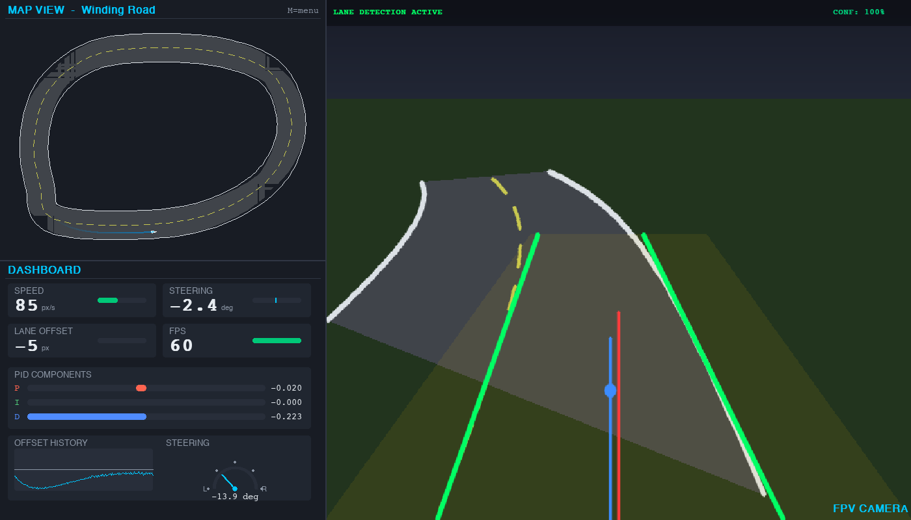
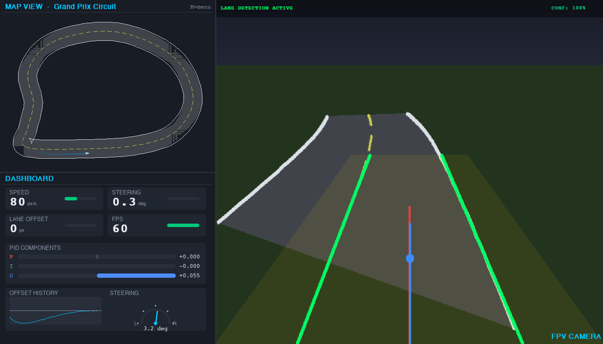
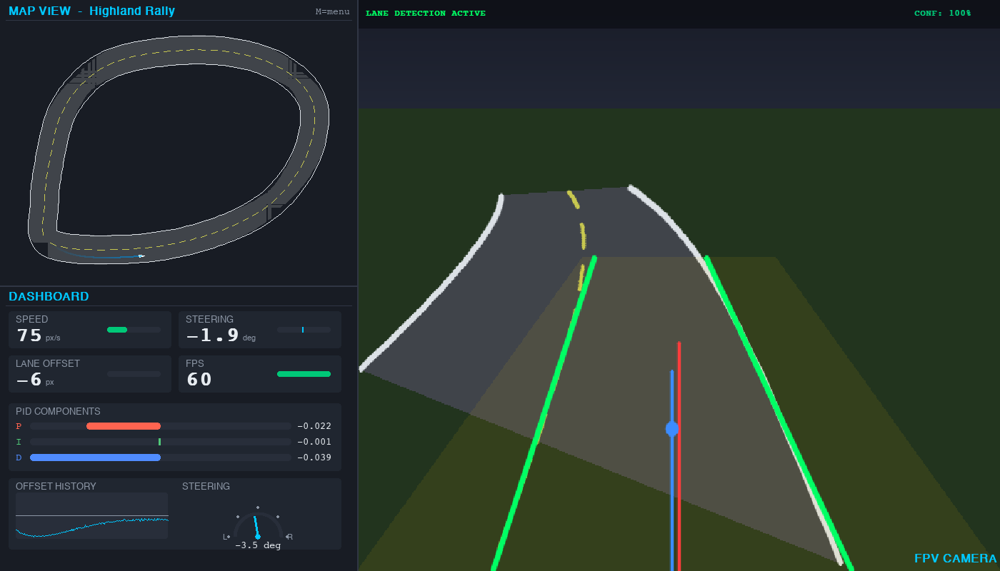
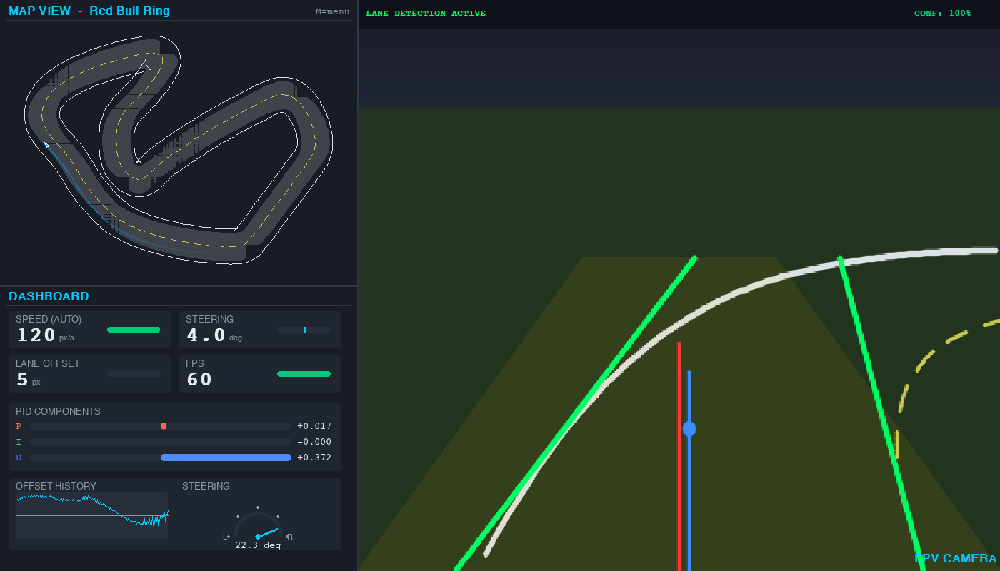

# Lane Detection and Autonomous Steering Simulator

A real-time lane detection and autonomous steering system built entirely with classical computer vision and control theory. The simulator renders a first-person camera view of a closed-loop track, detects lane markings, and steers a kinematic bicycle-model vehicle to stay centered in the lane -- all without deep learning.

Three detectors are compared with a shared interface:
**centroid** (HSV-thresholded road centroid baseline), **hough** (the classical Canny + Hough straight-line pipeline), and **polyfit** (a bird's-eye sliding-window 2nd-order polynomial fit). Two steering controllers are available: a **PID** law driven by the detector offset and a **Stanley** law driven by ground-truth track geometry as a perception-free reference. A headless evaluation harness (`evaluate.py` / `experiments.py`) logs per-frame lateral error, lane IoU and inference time so the methods can be compared quantitatively.

**Headline result.** Across five tracks, the polyfit detector cuts RMS lateral error by 34% relative to Hough (16.6 vs. 25.4 px mean) while staying real-time. The full study is written up in [`presentation/report.pdf`](presentation/report.pdf) with slides in [`presentation/slides.pdf`](presentation/slides.pdf).





---

## Table of Contents

- [Features](#features)
- [Available Tracks](#available-tracks)
- [System Architecture](#system-architecture)
- [Technical Details](#technical-details)
  - [Track Generation](#track-generation)
  - [Vehicle Model](#vehicle-model)
  - [FPV Camera](#fpv-camera)
  - [Detection Methods](#detection-methods)
  - [Steering Controllers](#steering-controllers)
  - [Adaptive Speed Controller](#adaptive-speed-controller)
- [Installation](#installation)
- [Usage and Controls](#usage-and-controls)
- [Evaluation Harness](#evaluation-harness)
- [Configuration](#configuration)
- [Project Structure](#project-structure)
- [How It Works](#how-it-works)
- [Performance](#performance)

---

## Features

- **Three Lane Detectors with a Shared Interface** -- a centroid baseline, the classical Canny + Hough pipeline, and a bird's-eye sliding-window polynomial fit. All three implement the same `LaneDetectorBase` contract in `lane_methods.py`, so the simulator and the headless evaluator can swap between them without code changes.
- **Two Steering Controllers** -- a PID controller driven by the detector's lane offset (the realistic case), and a Stanley controller driven by ground-truth track geometry as a perception-free upper-bound benchmark.
- **Headless Evaluation Harness** -- `evaluate.py` runs any (detector, controller, track) combination without a display window and logs per-frame lateral error, lane IoU, detection confidence, off-track flag and inference time. `experiments.py` sweeps the full grid, runs a Gaussian-noise robustness study and emits the figures and CSVs consumed by the report.
- **Bicycle Kinematic Vehicle Model** -- Physically grounded 2D vehicle simulation with wheelbase, steering angle limits, and heading updates.
- **First-Person Perspective Camera** -- Pinhole camera model with configurable field of view, pitch angle, and mounting height. Renders the track with perspective projection including road surface, solid lane boundaries, and dashed center lines.
- **3-Panel Real-Time UI** -- Built with Pygame, the interface includes:
  - **Map View** (top-left) -- Top-down view of the full track with the vehicle marker and trailing path.
  - **FPV Camera View** (right) -- Large panel showing the rendered camera feed with lane detection overlays, confidence indicator, and HUD.
  - **Dashboard** (bottom-left) -- Live gauges for speed, steering angle, lane offset, FPS, PID component breakdown (P/I/D bar chart), offset history sparkline, and a steering arc gauge.
- **5 Built-in Tracks** -- Five circuits of increasing difficulty, from a gentle oval to a challenging highland rally. Each track has tuned road width and recommended speed. A visual track selection screen with miniature previews lets you pick before driving.
- **Track Selection** -- Choose tracks via an interactive start screen (click or press 1-5) or from the command line with `--map`.
- **Catmull-Rom Spline Track** -- Smooth closed-loop tracks generated from editable waypoints using Catmull-Rom interpolation.
- **Temporal Smoothing** -- Detected lane lines and center offset are smoothed across frames to reduce jitter.
- **Real-Time Metrics** -- Speed, steering angle, lane offset, detection confidence, FPS, and individual PID component contributions are displayed and updated every frame.
- **Interactive Controls** -- Pause/resume, reset simulation, adjust speed, and return to track selector at any time.

---

## Available Tracks

The simulator includes five tracks of increasing difficulty. Each track has its own road width and recommended speed, tuned so the classical CV pipeline can keep the vehicle on the road.

| # | Track | Difficulty | Road Width | Speed | Waypoints | Description |
|---|-------|-----------|-----------|-------|-----------|-------------|
| 1 | `oval` | + - - - - | 110 px | 100 px/s | 12 | Gentle curves, ideal for understanding the system |
| 2 | `stadium` | + + - - - | 105 px | 95 px/s | 14 | Longer circuit with a kink on the back straight |
| 3 | `snake` | + + + - - | 100 px | 85 px/s | 12 | Sweeping S-curves with continuous direction changes |
| 4 | `grand_prix` | + + + + - | 100 px | 80 px/s | 13 | Esses, wide turns, and a long start/finish straight |
| 5 | `mountain` | + + + + + | 95 px | 75 px/s | 13 | Narrow road with a climb, summit bend, and descent |
| 6 | `redbull_ring` | + + + + + | 120 px | 120 px/s | 21 | F1 Red Bull Ring with sharp right-handers and adaptive speed control |

<details>
<summary>Track screenshots (click to expand)</summary>

**Simple Oval**


**Stadium Circuit**


**Winding Road**


**Grand Prix Circuit**


**Highland Rally**


**Red Bull Ring** (with adaptive speed control)


</details>

---

## System Architecture

The simulator follows a closed-loop pipeline that executes once per frame:

```
+-------+     +---------+     +-----+     +---------+     +--------+
| Track | --> | FPV     | --> | CV  | --> | PID     | --> | Vehicle|
| Data  |     | Camera  |     | Lane|     | Control |     | Model  |
|       |     | Render  |     | Det.|     |         |     | Update |
+-------+     +---------+     +-----+     +---------+     +--------+
                  ^                                            |
                  |          +----------+                      |
                  +--------- |  UI      | <--------------------+
                             | Renderer |
                             +----------+
```

**Data flow for a single frame:**

1. **Camera Render** -- The `FPVCamera` projects the road geometry ahead of the vehicle into a 640x480 pixel image using a pinhole perspective model.
2. **Lane Detection** -- The `LaneDetector` processes the rendered image through the classical CV pipeline to identify left and right lane boundaries and compute the vehicle's lateral offset from lane center.
3. **PID Control** -- The `PIDController` takes the normalized offset as error input and produces a steering angle command.
4. **Vehicle Update** -- The `Vehicle` applies the steering command through the bicycle kinematic model to update position and heading.
5. **UI Render** -- The `UI` class composites all three panels (map, FPV with annotations, dashboard) into the final display.

---

## Technical Details

### Track Generation

Each track is defined by a set of waypoints (12-14 per track, configurable in `config.py`) that form a closed loop. A **Catmull-Rom spline** interpolates between these waypoints to produce a smooth centerline with 60 samples per segment. The `Track` constructor accepts `waypoints` and `road_width` as parameters, making it straightforward to add custom tracks.

From the centerline, the system computes:

- **Tangent vectors** -- Normalized direction of travel at each point.
- **Normal vectors** -- Perpendicular to tangents (90-degree CCW rotation), used to offset left and right boundaries.
- **Lane boundaries** -- Centerline offset by half the road width (50 px each side for a 100 px road).
- **Center dashes** -- Alternating on/off segments (20 px dash, 15 px gap) computed by walking cumulative arc length.

The `Track` class also provides spatial queries: nearest centerline index with signed offset, heading at an index, and road geometry ahead of a given position.

### Vehicle Model

The vehicle uses a **bicycle kinematic model**, a standard simplification in autonomous driving that treats the car as a single-track vehicle:

```
x(t+dt) = x(t) + v * cos(theta) * dt
y(t+dt) = y(t) + v * sin(theta) * dt
theta(t+dt) = theta(t) + (v / L) * tan(delta) * dt
```

| Symbol    | Description           | Default Value |
|-----------|-----------------------|---------------|
| `v`       | Forward speed         | 100 px/s      |
| `L`       | Wheelbase             | 25 px         |
| `delta`   | Steering angle        | Computed by PID |
| `theta`   | Heading angle         | Track-aligned at start |
| `MAX_STEERING_ANGLE` | Steering limit | 40 degrees    |

The steering angle is clamped to the physical limit on every update. The timestep `dt` is capped at 50 ms to prevent numerical instability.

### FPV Camera

The camera simulates a **pinhole projection model** mounted on the vehicle:

| Parameter         | Value   | Description                           |
|-------------------|---------|---------------------------------------|
| Image size        | 640x480 | Output resolution                     |
| Field of view     | 70 deg  | Horizontal FOV                        |
| Mounting height   | 50 px   | Height above the ground plane         |
| Pitch angle       | 18 deg  | Downward tilt                         |
| Look-ahead        | 350 px  | How far ahead road geometry is fetched|

**Projection steps:**

1. Translate world points to car-relative coordinates.
2. Rotate to align the vehicle's forward direction with the camera's +Z axis.
3. Apply pitch rotation around the X-axis (downward tilt).
4. Perspective divide: `u = f * (x_cam / z) + cx`, `v = f * (y_cam / z) + cy`.
5. Filter out points behind the camera (`z <= 2.0`).

The renderer paints a gradient sky, a grass-colored ground plane below the computed horizon line, fills the road surface polygon, and draws solid white lane boundaries and dashed yellow center lines.

### Detection Methods

All three detectors live in `lane_methods.py` and implement the `LaneDetectorBase` interface. Each returns a `Detection` containing the bottom-of-image lane-centre offset, a look-ahead offset (useful for curves), a confidence in [0, 1], a predicted lane mask used for IoU scoring, and an annotated RGB image. They can be selected at run time via `--detector` or cycled live with the `D` key.

#### 1. Centroid (baseline)

The simplest possible method, kept as a lower bound.

1. Convert the camera frame to HSV.
2. Threshold the road surface (low saturation, moderate value -- the simulator paints it a uniform dark grey).
3. Apply the same trapezoidal ROI used by the other detectors.
4. Compute the centroid of the masked region with `cv2.moments`.
5. Offset = centroid x - image centre. Light EMA smoothing (alpha = 0.5).

#### 2. Hough (classical baseline)

The canonical "classical CV" pipeline described in the project brief. Treats each lane boundary as a single straight line. Works well on straights, breaks down on tight curves because a line of best fit underestimates curvature.

```
RGB -> Grayscale -> Gaussian blur (5x5) -> Canny (50/150)
    -> Trapezoidal ROI -> Probabilistic Hough (rho=1, theta=1 deg,
                                               thr=25, minLen=30, maxGap=40)
    -> Slope classification (neg+left = left lane; pos+right = right lane)
    -> Length-weighted averaging -> Extrapolation to image bounds
```

Temporal smoothing reuses the previous detection if a lane disappears; the centre offset is filtered with `SMOOTHING_ALPHA = 0.4`. Confidence is 1.0 (both lanes), 0.5 (one lane), 0.0 (none).

#### 3. Polyfit (proposed)

A bird's-eye + sliding-window pipeline that fits a 2nd-order polynomial per lane and so can model curves explicitly.

1. **Lane pixel mask** -- Sobel-x magnitude OR white-marking threshold (high V, low S) OR yellow-dash threshold (hue 15-40 deg).
2. **Inverse-perspective warp** -- a fixed `cv2.getPerspectiveTransform` maps the ROI trapezoid to a 320x320 top-down view.
3. **Histogram lane-base search** on the bottom half of the bird's-eye image.
4. **9 vertical sliding windows** (margin 50 px, min 50 pixels) track each base upward and recentre on the pixel mean.
5. **Polynomial fit** `x = a y^2 + b y + c` per lane (requires >200 pixels per side). Coefficients are EMA-smoothed across frames.
6. **Offsets** are computed at the bottom row (vehicle position) and at a look-ahead row (45% up the BEV). The PID consumes the look-ahead offset so the controller reacts to curves earlier.
7. **Lane polygon** is warped back to the camera image for the overlay and the IoU mask.

### Steering Controllers

Two controllers are implemented in `controller.py` and selected with `--controller` (or live-toggled with the `C` key).

#### PID (perception-based)

Takes the normalised lateral offset (range -1 to +1) from the lane detector and produces a steering angle in radians.

```
steering = Kp * e(t) + Ki * integral(e) + Kd * de/dt
```

| Gain  | Value | Role                                              |
|-------|-------|---------------------------------------------------|
| `Kp`  | 1.2   | Proportional -- reacts to current offset          |
| `Ki`  | 0.008 | Integral -- eliminates steady-state drift         |
| `Kd`  | 0.5   | Derivative -- dampens oscillation                 |

The integral term is clamped to +/-50.0 (anti-windup); the output is clamped to the vehicle's maximum steering angle (+/-40 deg). Individual P, I, D contributions are exposed for the dashboard. When the polyfit detector is active, the PID receives the look-ahead offset rather than the bottom-of-image offset.

#### Stanley (ground-truth oracle)

The Stanley law (Hoffmann et al., 2007) combines a cross-track term and a heading-error term:

```
delta = psi + atan2(k * e_cross, k_s + v)
```

where `psi` is the heading error between the vehicle and the desired track tangent, `e_cross` is the signed lateral distance of the front axle to the centreline, and `v` is the vehicle speed. `k_s` softens the denominator at low speed.

| Gain  | Value | Role                                              |
|-------|-------|---------------------------------------------------|
| `k`   | 0.6   | Cross-track gain                                  |
| `k_s` | 20.0  | Soft-speed constant (avoids 1/v blow-up)          |

In this implementation Stanley reads the *true* path geometry from the simulated track rather than the detector output. It therefore serves as a perception-free reference: the gap between PID-on-detection and Stanley-on-truth quantifies how much error the vision pipeline contributes.

### Adaptive Speed Controller

Tracks that set `adaptive_speed: True` (currently the Spa-Francorchamps circuit) use a curvature-based speed controller that automatically slows the vehicle before sharp turns and accelerates on straights.

**How it works:**

1. **Curvature pre-computation** -- At track creation, the discrete curvature is computed at every centerline point using the cross-product formula on finite differences, then smoothed with a 15-point rolling average.
2. **Look-ahead** -- Each frame, the controller queries the maximum curvature within 250 px ahead of the vehicle's current position.
3. **Speed target** -- The target speed is `gain / max_curvature`, clamped between `SPEED_MIN` (40 px/s) and the track's configured maximum speed.
4. **Asymmetric smoothing** -- The vehicle speed blends toward the target each frame. Braking is 3x faster than acceleration, modeling the real-world asymmetry where slowing down is more urgent than speeding up.

| Parameter | Value | Description |
|-----------|-------|-------------|
| `SPEED_MIN` | 40 px/s | Floor speed in the tightest curves |
| `SPEED_CURVATURE_GAIN` | 0.45 | Lower values produce more aggressive braking |
| `SPEED_LOOK_AHEAD_DIST` | 250 px | How far ahead to scan for upcoming curvature |
| `SPEED_SMOOTHING` | 0.06 | Per-frame blend factor (braking uses 3x this value) |

When adaptive speed is active, the dashboard shows "SPEED (AUTO)" and the speed gauge color changes from green (near max) to yellow (moderate reduction) to red (heavy braking).

---

## Installation

### Prerequisites

- Python 3.9 or later
- A display environment capable of running Pygame (not a headless server)

### Setup

1. Clone the repository:

```bash
git clone https://github.com/davtovmas/lane-detection.git
cd lane-detection
```

2. Create and activate a virtual environment (recommended):

```bash
python -m venv venv
source venv/bin/activate   # macOS / Linux
venv\Scripts\activate      # Windows
```

3. Install dependencies:

```bash
pip install -r requirements.txt
```

The simulator itself depends on three packages:

| Package           | Minimum Version | Purpose                          |
|-------------------|-----------------|----------------------------------|
| `numpy`           | 1.24            | Numerical computation            |
| `opencv-python`   | 4.8             | Image processing and CV pipeline |
| `pygame-ce`       | 2.5             | Window management and rendering  |

`experiments.py` additionally requires `matplotlib` (any recent version) to render the figures in `presentation/figures/`. Install with `pip install matplotlib` before running the experiment sweep.

4. Run the simulator:

```bash
python main.py                                  # Opens the track selection screen
python main.py --map oval                       # Jump straight into a specific track
python main.py --map mountain                   # Available tracks: oval, stadium, snake,
                                                # grand_prix, mountain, redbull_ring
python main.py --detector polyfit               # Choose detector: centroid | hough | polyfit
python main.py --controller stanley             # Choose controller: pid | stanley
python main.py --map snake --detector polyfit --controller pid
```

---

## Usage and Controls

When launched without `--map`, the simulator displays a **track selection screen** with miniature previews of all five circuits. Click a card or press 1-5 to start. When launched with `--map <name>`, the simulation starts immediately on the chosen track.

During simulation, the vehicle begins at the first track waypoint and immediately starts driving and steering autonomously.

### Keyboard Controls

| Key          | Action                                      |
|--------------|---------------------------------------------|
| `Space`      | Pause / resume the simulation               |
| `R`          | Reset the vehicle to the starting position  |
| `M`          | Return to the track selection screen        |
| `D`          | Cycle the lane detector (centroid -> hough -> polyfit) |
| `C`          | Toggle the steering controller (PID <-> Stanley) |
| `Up Arrow`   | Increase speed by 20 px/s (max 300 px/s)    |
| `Down Arrow` | Decrease speed by 20 px/s (min 40 px/s)     |
| `Esc`        | Quit the simulator                          |

### UI Panels

- **Map View** (500x400, top-left) -- Displays the full track with road surface, lane boundaries, dashed center line, the vehicle's trailing path with fade-in alpha, and a triangular car marker oriented by heading.
- **FPV Camera** (900x800, right) -- Shows the perspective-projected camera feed scaled to fill the panel. A HUD overlay at the top displays "LANE DETECTION ACTIVE" and the current detection confidence. Detected lanes are drawn in green, the vehicle center reference in red, and the estimated lane center in blue.
- **Dashboard** (500x400, bottom-left) -- Contains six visualization components:
  - Speed gauge (px/s with fill bar)
  - Steering angle gauge (degrees with centered bar)
  - Lane offset display (pixels with color-coded severity)
  - FPS counter
  - PID component bar chart (P in red, I in green, D in blue with signed centered bars and numeric values)
  - Bottom section split between an offset history sparkline (200-sample rolling window) and a semicircular steering arc gauge with tick marks, needle, and L/R labels.

---

## Evaluation Harness

The simulator can be run headlessly through `evaluate.py` to produce quantitative metrics for any (detector, controller, track) triple. Per-frame logs include `t, x, y, heading, speed, true_offset, true_heading_err, det_offset, det_lookahead, det_confidence, steering, lane_iou, off_track, detect_ms`. Aggregate metrics include mean and RMS lateral error (px), max lateral error, mean lane IoU vs the simulator's ground-truth road polygon, off-track rate, lap completion, lap time, and mean detector inference time.

```bash
# Single run, write a per-frame CSV
python evaluate.py --detector polyfit --controller pid --track snake \
    --laps 1 --out presentation/results/snake_polyfit_pid.csv

# Add Gaussian camera noise to evaluate robustness (sigma in [0, 1])
python evaluate.py --detector hough --controller pid --track oval --noise 0.05
```

The full experiment sweep is driven by `experiments.py`:

```bash
python experiments.py
```

It runs three studies and writes their outputs into `presentation/`:

| Experiment | Sweeps                                                                 | Output |
|------------|------------------------------------------------------------------------|--------|
| E1 -- Method comparison | every (detector, controller) pair on 5 tracks                | `presentation/results/summary.csv`, RMS/IoU bar charts |
| E2 -- Noise robustness  | 3 detectors x 5 noise levels (0.00, 0.02, 0.05, 0.10, 0.20) on the oval | `presentation/results/noise.csv`, `presentation/figures/noise.*` |
| E3 -- Trajectory log    | per-frame snake-track trace for Hough and Polyfit (PID)      | `presentation/results/trace_snake_*.csv`, `presentation/figures/snake_traces.*` |

`make_qualitative_figures.py` renders the example-annotation panels used in the report from saved camera frames.

The headline number from E1: **polyfit reduces RMS lateral error by 34% relative to Hough** (16.6 px vs. 25.4 px mean across the five tracks) while remaining real-time. Stanley-on-truth lap times bound how much of the residual error is perception-induced vs. controller-induced. See `presentation/report.pdf` for the full write-up and `presentation/slides.pdf` for the deck.

---

## Configuration

All tunable parameters are centralized in `config.py`. Below are the key parameters grouped by subsystem.

### Window and Layout

| Parameter       | Default | Description                     |
|-----------------|---------|---------------------------------|
| `WINDOW_WIDTH`  | 1400    | Total window width in pixels    |
| `WINDOW_HEIGHT` | 800     | Total window height in pixels   |
| `FPS_TARGET`    | 60      | Target frame rate               |

### Tracks

Tracks are defined in the `TRACKS` dictionary in `config.py`. Each entry contains `waypoints`, `road_width`, `speed`, `difficulty`, and `description`. To add a custom track, add a new entry to the dictionary.

| Parameter                | Default | Description                              |
|--------------------------|---------|------------------------------------------|
| `LANE_DASH_LENGTH`       | 20.0    | Center line dash length                  |
| `LANE_DASH_GAP`          | 15.0    | Center line gap length                   |
| `TRACK_SAMPLES_PER_SEGMENT` | 60   | Spline interpolation density             |
| `DEFAULT_TRACK`          | `"oval"`| Fallback track when none specified       |

### Vehicle

| Parameter            | Default     | Description                     |
|----------------------|-------------|---------------------------------|
| `WHEELBASE`          | 25.0        | Distance between axles          |
| `MAX_STEERING_ANGLE` | 40 degrees  | Maximum steering lock           |
| `VEHICLE_SPEED`      | 100.0       | Initial speed in px/s           |
| `CAR_LENGTH`         | 20.0        | Visual car length               |
| `CAR_WIDTH`          | 10.0        | Visual car width                |

### Camera

| Parameter           | Default | Description                          |
|---------------------|---------|--------------------------------------|
| `CAMERA_IMG_W`      | 640     | Rendered image width                 |
| `CAMERA_IMG_H`      | 480     | Rendered image height                |
| `CAMERA_FOV_DEG`    | 70.0    | Horizontal field of view in degrees  |
| `CAMERA_HEIGHT`     | 50.0    | Camera mounting height               |
| `CAMERA_PITCH_DEG`  | 18.0    | Downward pitch angle in degrees      |
| `CAMERA_LOOK_AHEAD` | 350.0   | Road geometry fetch distance         |

### Vision Pipeline

| Parameter          | Default    | Description                            |
|--------------------|------------|----------------------------------------|
| `GAUSSIAN_KERNEL`  | (5, 5)     | Blur kernel size                       |
| `CANNY_LOW`        | 50         | Canny lower threshold                  |
| `CANNY_HIGH`       | 150        | Canny upper threshold                  |
| `HOUGH_THRESHOLD`  | 25         | Hough accumulator threshold            |
| `HOUGH_MIN_LINE_LEN` | 30      | Minimum detected line length           |
| `HOUGH_MAX_LINE_GAP`  | 40      | Maximum gap between line segments      |
| `ROI_TOP_RATIO`    | 0.45       | ROI top boundary as fraction of height |
| `SLOPE_MIN`        | 0.3        | Minimum absolute slope to accept a line|
| `SMOOTHING_ALPHA`  | 0.4        | Offset EMA smoothing factor            |

### PID Controller

| Parameter            | Default | Description                          |
|----------------------|---------|--------------------------------------|
| `KP`                 | 1.2     | Proportional gain                    |
| `KI`                 | 0.008   | Integral gain                        |
| `KD`                 | 0.5     | Derivative gain                      |
| `PID_INTEGRAL_LIMIT` | 50.0    | Anti-windup integral clamp           |

### Stanley Controller

| Parameter   | Default | Description                                            |
|-------------|---------|--------------------------------------------------------|
| `STANLEY_K` | 0.6     | Cross-track gain                                       |
| `STANLEY_KS`| 20.0    | Soft-speed constant (prevents 1/v blow-up at low v)    |

---

## Project Structure

```
lane-detection/
├── main.py                    # Entry point: CLI args, track selector, simulation loop
├── config.py                  # Constants, 6 track definitions, tunable parameters
├── track.py                   # Track generation with Catmull-Rom spline interpolation
├── vehicle.py                 # Bicycle kinematic vehicle model
├── camera.py                  # FPV camera with pinhole perspective projection
├── vision.py                  # Legacy single-detector module (kept for reference)
├── lane_methods.py            # Centroid / Hough / Polyfit detectors with shared interface
├── controller.py              # PID + Stanley steering, adaptive speed controller
├── ui.py                      # 3-panel Pygame UI (map, FPV, dashboard)
├── evaluate.py                # Headless single-run evaluator + per-frame CSV logging
├── experiments.py             # E1/E2/E3 experiment sweep + figure generation
├── make_qualitative_figures.py# Example-annotation panels for the report
├── requirements.txt           # Python dependencies
├── description.md             # Original project specification
├── docs/                      # Track and simulator screenshots
│   ├── track_selector.png
│   ├── track_oval.png
│   ├── track_stadium.png
│   ├── track_snake.png
│   ├── track_grand_prix.png
│   ├── track_mountain.png
│   └── track_redbull_ring.png
├── presentation/
│   ├── report.pdf             # 3-page write-up
│   ├── report.tex
│   ├── slides.pdf             # 24-slide deck
│   ├── slides.tex
│   ├── make_table.py          # Renders the summary LaTeX table from results CSV
│   ├── figures/               # Generated by experiments.py / make_qualitative_figures.py
│   └── results/               # CSV outputs from experiments.py
└── README.md                  # This file
```

---

## How It Works

Below is a step-by-step walkthrough of a single simulation frame.

### 1. Clock Tick

`pygame.time.Clock.tick(60)` limits the frame rate and returns the elapsed time `dt` in milliseconds. The value is converted to seconds and capped at 50 ms to prevent physics instability from lag spikes. FPS is tracked with an exponential moving average (95/5 blend).

### 2. Event Processing

Pygame events are polled for quit, pause toggle (`Space`), reset (`R`), speed adjustment (`Up`/`Down`), and exit (`Esc`). If paused, the UI is drawn without advancing the simulation state.

### 3. FPV Camera Render

The `FPVCamera.render()` method:

1. Copies the pre-computed sky gradient onto a blank 640x480 image.
2. Computes the horizon line from the camera pitch and fills everything below it with grass color.
3. Queries the track for road geometry (left boundary, right boundary, center line) ahead of the vehicle up to the look-ahead distance (350 px).
4. Projects all 3D ground-plane points into 2D image coordinates using the pinhole model with pitch rotation.
5. Fills the road surface polygon between the projected left and right boundaries.
6. Draws solid white polylines for both lane boundaries.
7. Draws dashed yellow segments for the center line.

### 4. Lane Detection

The active detector's `detect()` method receives the rendered RGB image and returns a `Detection` with `center_offset`, `lookahead_offset`, `confidence`, a predicted lane mask and an annotated image. Which work happens here depends on which method is active (see [Detection Methods](#detection-methods)):

- **centroid** -- HSV threshold of the road surface, trapezoidal ROI, centroid of the moment image, light EMA smoothing.
- **hough** -- grayscale, 5x5 Gaussian blur, Canny (50/150), trapezoidal ROI, probabilistic Hough, slope-classified left/right segments, length-weighted average and extrapolation, EMA-smoothed offset.
- **polyfit** -- combined Sobel + colour mask, inverse-perspective warp to a 320x320 bird's-eye view, histogram lane-base search, 9-window sliding fit, 2nd-order polynomial per lane, offsets evaluated at the vehicle position and at a look-ahead row, lane polygon warped back to the camera frame.

### 5. Steering

If the PID controller is active, the chosen offset (look-ahead for polyfit, bottom-of-image for the others) is normalised to [-1, +1] by half the image width and consumed by:

1. Proportional term: `P = Kp * error`.
2. Integral: `I = Ki * clamp(integral + error * dt, +/-PID_INTEGRAL_LIMIT)`.
3. Derivative: `D = Kd * (error - prev_error) / dt`.
4. `steering = clamp(P + I + D, +/-MAX_STEERING_ANGLE)`.

If the Stanley controller is active, the camera frame is still computed (so the UI and metrics keep working) but the steering command is produced from the ground-truth track geometry: it queries the nearest centreline index for the front axle, takes the heading error `psi` and signed cross-track error `e_cross`, and computes `delta = psi + atan2(k * e_cross, k_s + v)`.

### 6. Vehicle Update

The bicycle kinematic model advances the vehicle state:

1. Clamps the steering command to the physical steering limit.
2. Updates position: `x += speed * cos(heading) * dt`, `y += speed * sin(heading) * dt`.
3. Updates heading: `heading += (speed / wheelbase) * tan(steering) * dt` (skipped for near-zero steering to avoid division artifacts).
4. Appends the new position to the trailing path buffer (400-point deque).

### 7. UI Render

The `UI.draw()` method composites all three panels onto the Pygame display surface:

- The **map panel** transforms world coordinates to screen space, draws the road and boundaries, renders the fading trail, and places the triangular vehicle marker.
- The **FPV panel** converts the annotated OpenCV image (NumPy array) to a Pygame surface via `surfarray.make_surface()`, scales it to fill the 900x800 panel, and overlays the HUD bar with detection status and confidence.
- The **dashboard** renders metric cards with animated value interpolation, centered bar gauges, the PID component breakdown, the offset history sparkline, and the semicircular steering arc gauge.

Finally, `pygame.display.flip()` presents the completed frame.

---

## Performance

The simulator is designed to run comfortably above 60 FPS on modern hardware. The frame rate target is set to 60 FPS via `pygame.time.Clock.tick()`.

Key performance characteristics:

- **Rendering** -- The FPV camera uses NumPy vectorized operations for coordinate transforms and OpenCV for polygon fills and line drawing, avoiding per-pixel Python loops.
- **Vision pipeline** -- All CV operations (blur, Canny, Hough) are backed by OpenCV's optimized C++ implementations.
- **Sky gradient** -- Pre-computed once at initialization and reused via array copy each frame.
- **Spline geometry** -- Track interpolation, tangents, normals, and boundaries are computed once at startup. Per-frame work is limited to spatial queries (nearest-index lookup and ahead-of-car slicing).
- **FPS tracking** -- An exponential moving average (5% new, 95% old) provides a stable FPS readout displayed on the dashboard.

Typical performance on a modern laptop exceeds 60 FPS with all three panels rendering simultaneously.

---

## License

This project was developed as a demonstration of classical computer vision and control theory applied to autonomous driving simulation.
